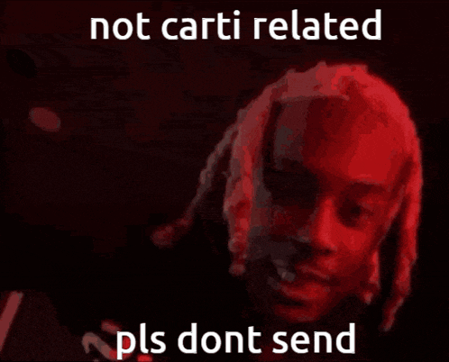

> [!NOTE]
> If you find our repository useful bookmark it so you never lose it!

<h3 align="center">
  
</h3>

<h1 align="center">#RBXFLAG$</h1>

<h3 align="center">
  
</h3>

<h6 align="center">.gg/fastflags</h6>

> [!CAUTION]
> **Fast Flags are extremely powerful, being that they are intended to only be used by Roblox engineers. While they can be very useful, they can cause issues with stability and functionality if you don't know what you're doing.**

#### Version: `01.10.25`
* **215 Currently Listed**
* **List is FREE. Forever.**

## List Meanings
**✨ - sOmethin rare hArd to get > like a holy treAsure its dat one thIng you gotta hAve could be a shoe a cAr or a piece of arT + everybody wAnts it but only a fEw get it = it’s dat uLtimate find ya feel me?**
